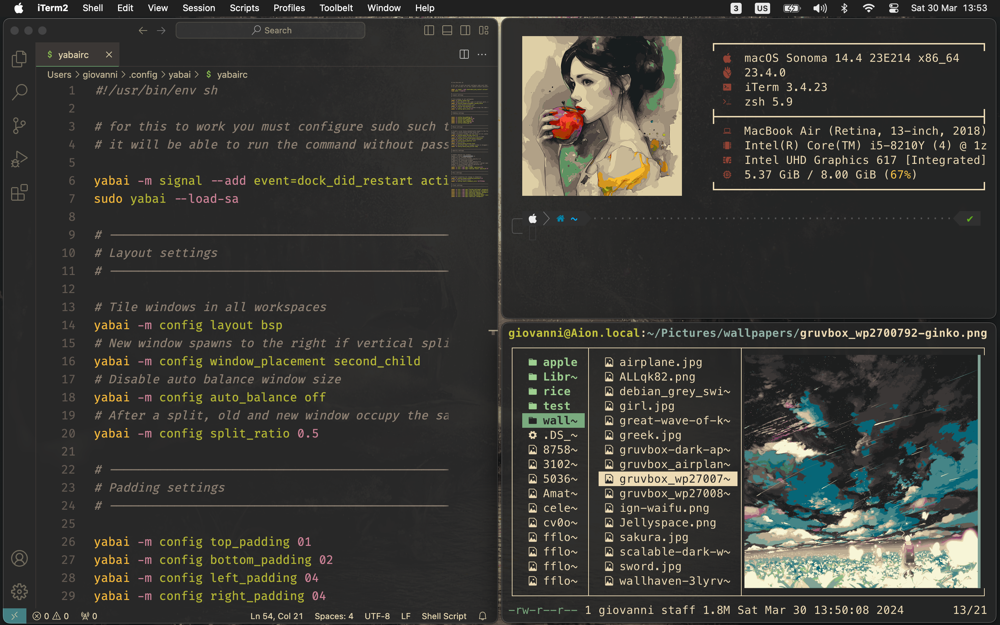
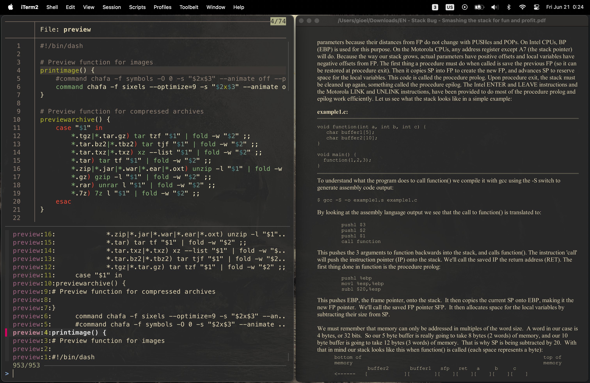

# dotfiles

This repository contains a collection of configuration files crafted for my macOS setup. The setup is designed to enhance my experience for development and daily use, striking a harmonious balance between aesthetics and efficiency. The productivity aspects of this setup, pertaining to programs, binaries, and programming workflows, can be easily adapted for use in Linux with minor adjustments.

This configuration is quite elaborate and makes heavy use of external programs and binaries. Despite its complexity, the configuration remains relatively lean in terms of disk space and memory / CPU overhead.

To provide coherency in visual appeal, I am using the [gruvbox](https://github.com/morhetz/gruvbox) dark theme with a moderate level of transparency across most applications.

## Gallery






## Dependencies

Here are some of the programs and binaries that I use in this setup.

### Recommended Programs

[`Visual Studio Code`](https://code.visualstudio.com/): main code editor

[`Sublime Text`](https://www.sublimetext.com/): alternative code editor and note taking

[`iTerm2`](https://iterm2.com/): terminal emulator

[`Raycast`](https://www.raycast.com/): replacement launcher for Spotlight

[`SpaceId`](https://github.com/dshnkao/SpaceId): space indicator for macOS menu bar

[`Via`](https://github.com/the-via): keyboard configuration

[`Mos`](https://github.com/Caldis/Mos): smooth scrolling for external mouse

[`Firefox`](https://www.mozilla.org/en-US/firefox/new/): browser

[`Adobe Photoshop`](https://www.adobe.com/products/photoshop.html): image editing

[`Adobe InDesign`](https://www.adobe.com/products/indesign.html): page layout design

[`Spotify`](https://github.com/dshnkao/SpaceId): music player (patched with [`SpotX-Bash`](https://github.com/SpotX-Official/SpotX-Bash))

[`KeePassX`](https://www.keepassx.org/): password manager

[`OmniDiskSweeper`](https://www.omnigroup.com/more): free disk space

### Recommended Binaries

[`yabai`](https://github.com/koekeishiya/yabai): tiling window manager

[`skhd`](https://github.com/koekeishiya/skhd): hotkeys for yabai

[`eza`](https://github.com/eza-community/eza): replacement for `ls`

[`bat`](https://github.com/sharkdp/bat): replacement for `cat`

[`bat-extras`](https://github.com/eth-p/bat-extras): scripts to integrate `bat` with other tools

[`fzf`](https://github.com/junegunn/fzf): command-line fuzzy finder

[`ripgrep`](https://github.com/BurntSushi/ripgrep): replacement for `grep`

[`fd`](https://github.com/sharkdp/fd): replacement for `find`

[`lf`](https://github.com/gokcehan/lf): terminal file manager

[`delta`](https://github.com/dandavison/delta): pager for git/diff

[`forgit`](https://github.com/wfxr/forgit): integrate `git` with `fzf`

[`tgpt`](https://github.com/aandrew-me/tgpt): AI chatbot in the terminal

[`bottom`](https://github.com/ClementTsang/bottom): graphical process/system monitor for the terminal

[`chafa`](https://github.com/hpjansson/chafa): display images in terminal

[`fastfetch`](https://github.com/fastfetch-cli/fastfetch): fetch and display system information

[`shellcheck`](https://github.com/koalaman/shellcheck): script static analysis tool

[`checkbashisms`](https://formulae.brew.sh/formula/checkbashisms): check for bashisms in `/bin/sh` scripts 

[`cowsay`](https://formulae.brew.sh/formula/cowsay): cow ASCII art with messages

[`fortune`](https://formulae.brew.sh/formula/fortune): fortune-cookie generator

[`ani-cli`](https://github.com/pystardust/ani-cli): browse and watch anime from terminal

[`gruvbox-factory`](https://github.com/paulopacitti/gruvbox-factory): manufacture a gruvbox themed wallpaper

[`xz`](https://formulae.brew.sh/formula/xz): data compression

[`unrar`](https://formulae.brew.sh/cask/rar): data compression

[`7z`](https://formulae.brew.sh/formula/p7zip): data compression

[`ffmpegthumbnailer`](https://formulae.brew.sh/formula/ffmpegthumbnailer): thumbnails for video files

[`pdftoppm`](https://formulae.brew.sh/formula/poppler): PDF rendering library

[`docx2txt.pl`](https://formulae.brew.sh/formula/docx2txt): convert docx documents to text documents

[`gnumeric`](https://formulae.brew.sh/formula/gnumeric): GNOME Spreadsheet Application

## Instructions

Here are some configuration instructions.

### Wallpaper

The wallpaper I use can be found in the `.config` directory. You can choose any other wallpaper. To increase the resoultion of anime-style images, I use the In-Browser version of [waifu2x](https://github.com/nagadomi/waifu2x). To harmonize the chosen image with the gruvbox theme, I use [gruvbox-factory](https://github.com/paulopacitti/gruvbox-factory).

### macOS Settings

Most of my custom settings revolve around tweaking the appearance of the macOS interface and optimizing keyboard shortcuts for efficient navigation. 

To keep my workspace clutter-free, I prefer to keep the dock hidden at all times. This is easily achieved using a script located in the `raycast` directory, allowing me to toggle the visibility of the dock as needed.
\
To provide a solid color to the menu bar, I activate the "Reduce transparency" option in System Settings.

To streamline the use of [yabai](https://github.com/koekeishiya/yabai), I've configured a few custom keybindings. Notably, in the "Keyboard shortcuts" section under "Mission Control," I utilize keybindings such as <kbd>^N</kbd> to switch to desktop N. To ensure seamless functionality, it's essential to deactivate the "Automatically rearrange Spaces based on most recent use" option.


### Shell

I use zsh as my preferred shell. 
\
I use [Oh My Zsh](https://github.com/ohmyzsh/ohmyzsh) as a framework for managing configurations and plugins.
\
As theme, I use [Powerlevel10k](https://github.com/romkatv/powerlevel10k). For this theme to work correctly and display icons properly, I use the [MesloLGS NF](https://github.com/romkatv/powerlevel10k/blob/master/font.md) font.

I am using three custom plugins, which are not included by default on `Oh My Zsh`:
- [zsh-autosuggestions](https://github.com/zsh-users/zsh-autosuggestions): fish shell-like autosuggestions
- [zsh-syntax-highlighting](https://github.com/zsh-users/zsh-syntax-highlighting): fish shell-like syntax highlighting
- [dirbrowse](https://github.com/giovannilupi/dirbrowse): fast browsing through the directory stack

The rest of the configuration can be found in the `.zshrc` file. I also created an empty `.hushlogin` file in the home directory to disable the automatic last login message print when opening a new sesssion.

### iTerm2

For my complete iTerm2 configuration, you can find a copy of my settings in the `iterm2` directory of this repository. For the font, I am using [MesloLGS NF](https://github.com/romkatv/powerlevel10k/blob/master/font.md). To enhance the appearance, I am using [this](https://github.com/herrbischoff/iterm2-gruvbox) gruvbox theme, combined with 5% window transparency. To maximize screen real estate, I've removed the title bar in the settings.

### Visual Studio Code

As editor font, I am using [FiraCode](https://github.com/tonsky/FiraCode) with ligatures enabled. To maintain coherency with my terminal, I use [MesloLGS NF](https://github.com/romkatv/powerlevel10k/blob/master/font.md) as font for the VSCode integrated terminal. Additionally, I've configured a few more settings to enable image display within the integrated terminal. Here are some relevant snippets from my `settings.json` file:
```
    "terminal.integrated.fontFamily": "MesloLGS NF",
    "terminal.integrated.sendKeybindingsToShell": true,
    "terminal.integrated.fontSize": 16,
    "editor.fontSize": 17,
    "terminal.integrated.gpuAcceleration": "canvas",
    "terminal.integrated.enableImages": true,
    "editor.inlayHints.fontFamily": "MesloLGS NF",
    "editor.fontFamily": "Fira Code",
    "editor.fontLigatures": true
```
For keybindings, I've only set up one custom binding, which toggles the maximized panel using <kbd>ctrl</kbd>+<kbd>shift</kbd>+<kbd>m</kbd>. This binding can be added to the `keybindings.json` file:
```
    "key": "ctrl+shift+m",
    "command": "workbench.action.toggleMaximizedPanel",
```
To maintain a consistent appearance across my workspace I use [this](https://marketplace.visualstudio.com/items?itemName=jdinhlife.gruvbox) gruvbox dark medium theme, while window transparency is managed through yabai. Some of the other extensions I use in my workflow include: Perl Navigator, ShellCheck, C/C++, Remote - SSH, Remote Explorer, Python, LiveShare, and GitLens.

### Sublime Text

I use Sublime as alternative code editor (mainly for scripting) and for note taking purposes. The `raycast` directory includes a script to open at its last line a note file located at `~/Documents/notes`. For appearance, I am using [this](https://github.com/Briles/gruvbox) gruvbox theme and color scheme. To optimize screen real estate, I've reduced the size of tabs and the status bar using some custom settings (Preferences):
```
	"color_scheme": "gruvbox (Dark) (Medium).sublime-color-scheme",
	"font_size": 18,
	"theme": "gruvbox.sublime-theme",
	"gruvbox_tabs_xxs": true,
	"gruvbox_statusbar_xxs": true,
```
Window transparency is managed through yabai.

To disable the periodic license popup, add the following lines to `/etc/hosts`:
```
127.0.0.1       www.sublimetext.com
127.0.0.1       license.sublimehq.com
```

### Firefox

Firefox is my default browser. To enhance privacy and minimize data collection, I disable telemetry and data collection following [this](https://wiki.archlinux.org/title/Firefox/Privacy) and [this](https://github.com/K3V1991/Disable-Firefox-Telemetry-and-Data-Collection) guide. To visually integrate with my setup, I am using [this](https://addons.mozilla.org/en-US/firefox/addon/gruvboxtheme/) gruvbox theme. As browsing add-ons, I am using uBlock Origin and TWP - Translate Web Pages.

### yabai

I recommend installing the binary using the yabai [installer script](https://github.com/koekeishiya/yabai/wiki/Installing-yabai-(latest-release)). When using Homebrew, each update causes the binary to be stored at a different path, effectively resetting the permissions. Because the binary is updated frequently, resetting permissions so often is far from ideal. To ease the updates for the script install, I have added a function in the `.zshrc` file.

The configuration file for yabai is included in this repository. To unlock the full range of features, including window transparency, it's essential to partially disable System Integrity Protection, as outlined in the yabai documentation.

### lf

This is one of the binaries I use most frequently. Setting it up is straightforward, as lf automatically detects configuration files located in `.config/lf`. For Linux setups, the `lfrc` config file is largely compatible, although adjustments may be necessary. First, some of the key binds might not be suitable outside of macOS. Second, this file includes some commands specific to macOS, such as `pbcopy`.

To enable file previews, ensure that the `preview` script is executable. The previwer uses chafa in conjunction with the sixel protocol to display images. You can check if you terminal emulator supports the sixel protocol [here](https://www.arewesixelyet.com/). If your terminal emulator does not provide sixel support, you can modify the previewer to use a different protocol, or to dispaly images using the ascii art option.

### fzfscripts

These are a collection of scripts that I have designed and written for convenience, requiring no particular configuration. 

The `crange` function is a useful tool for selecting and outputting a range of lines from a file using the fzf interface. I frequently employ this script to pipe output to tgpt, allowing me to pose questions to an AI chatbot.

The `ffile`, `fdir`, and `fline` functions streamline development tasks by facilitating the quick opening of files in VSCode or changing directories with ease.