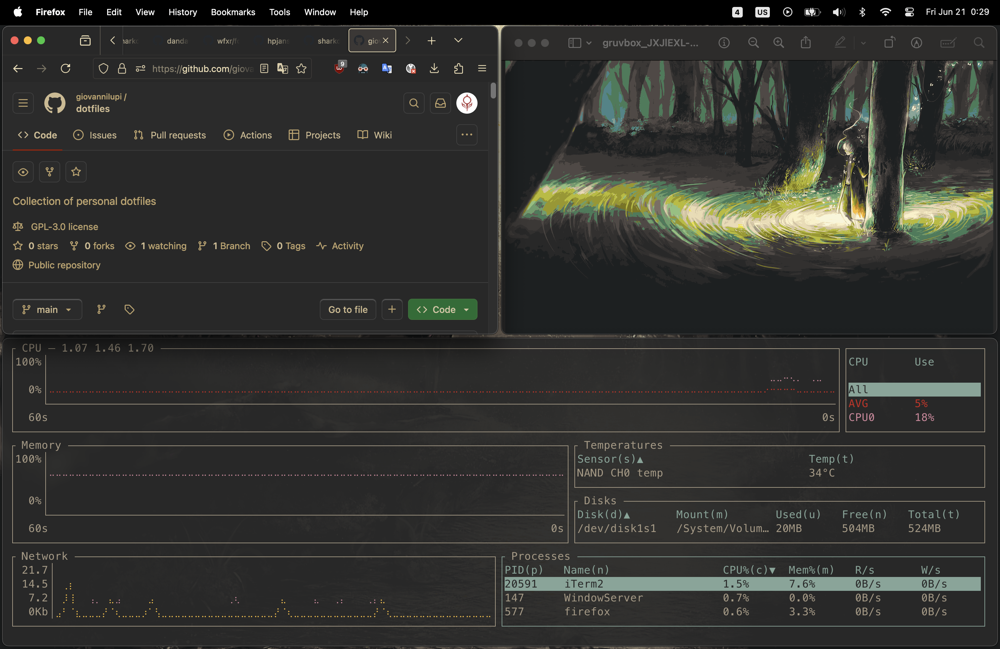

# dotfiles

This repository contains a collection of configuration files crafted for my macOS setup. The setup is designed to enhance my experience for development and daily use, striking a harmonious balance between aesthetics and efficiency.

This configuration is quite elaborate and makes heavy use of external programs and binaries. Despite its complexity, the configuration remains relatively lean in terms of disk space and memory / CPU overhead.

To provide coherency in visual appeal, I am using the [gruvbox](https://github.com/morhetz/gruvbox) dark theme with a moderate level of transparency across most applications.

## Gallery

