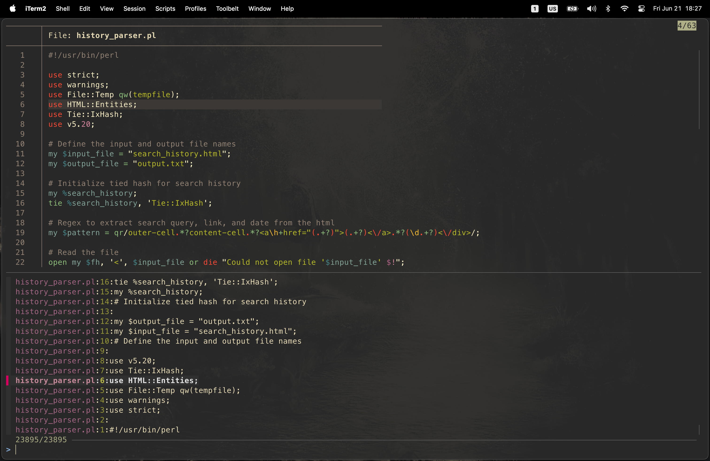

# dotfiles

This repository contains a collection of configuration files crafted for my macOS setup. The setup is designed to enhance my experience for development and daily use, striking a balance between aesthetics and efficiency. The productivity aspects of this setup, pertaining to programs, binaries, and programming workflows, can be easily adapted for use in Linux with minor adjustments.

This configuration is quite elaborate and makes heavy use of external programs and binaries. Despite its complexity, the configuration remains relatively lean in terms of disk space and memory / CPU overhead.

To provide coherency in visual appeal, I am using the [gruvbox](https://github.com/morhetz/gruvbox) dark theme with a moderate level of transparency across most applications.

## Gallery


## Dependencies

Here are some of the programs and binaries that I use in this setup.

### Recommended Programs

[`VSCodium`](https://github.com/VSCodium/vscodium): main code editor

[`Sublime Text`](https://www.sublimetext.com/): alternative code editor and quick notes

[`Joplin`](https://github.com/laurent22/joplin): Markdown note taking

[`iTerm2`](https://iterm2.com/): terminal emulator

[`TopNotch`](https://topnotch.app/): blends macbook notch into a black menu bar

[`Raycast`](https://www.raycast.com/): replacement launcher for Spotlight

[`SpaceId`](https://github.com/dshnkao/SpaceId): space indicator for macOS menu bar

[`Via`](https://github.com/the-via): keyboard configuration

[`Mos`](https://github.com/Caldis/Mos): smooth scrolling for external mouse

[`Firefox`](https://www.mozilla.org/en-US/firefox/new/): browser

[`GIMP`](https://www.gimp.org/): image editing

[`Scribus`](https://wiki.scribus.net/canvas/Download): page layout design

[`Spotify`](https://github.com/SpotX-Official/SpotX-Bash): music player (patched with [`SpotX-Bash`](https://github.com/SpotX-Official/SpotX-Bash))

[`KeePassXC`](https://keepassxc.org/): password manager

### Recommended Binaries

[`homebrew`](https://brew.sh/): macOS package manager

[`yabai`](https://github.com/koekeishiya/yabai): tiling window manager

[`skhd`](https://github.com/koekeishiya/skhd): hotkeys for yabai

[`neovim`](https://github.com/neovim/neovim): modern replacement for `vim`

[`eza`](https://github.com/eza-community/eza): replacement for `ls`

[`bat`](https://github.com/sharkdp/bat): replacement for `cat`

[`bat-extras`](https://github.com/eth-p/bat-extras): scripts to integrate `bat` with other tools

[`fzf`](https://github.com/junegunn/fzf): command-line fuzzy finder

[`ripgrep`](https://github.com/BurntSushi/ripgrep): replacement for `grep`

[`fd`](https://github.com/sharkdp/fd): replacement for `find`

[`lf`](https://github.com/gokcehan/lf): terminal file manager

[`delta`](https://github.com/dandavison/delta): pager for git/diff

[`forgit`](https://github.com/wfxr/forgit): integrate `git` with `fzf`

[`tgpt`](https://github.com/aandrew-me/tgpt): AI chatbot in the terminal

[`bottom`](https://github.com/ClementTsang/bottom): graphical process/system monitor for the terminal

[`chafa`](https://github.com/hpjansson/chafa): display images in terminal

[`fastfetch`](https://github.com/fastfetch-cli/fastfetch): fetch and display system information

[`shellcheck`](https://github.com/koalaman/shellcheck): script static analysis tool

[`checkbashisms`](https://formulae.brew.sh/formula/checkbashisms): check for bashisms in `/bin/sh` scripts

[`cowsay`](https://formulae.brew.sh/formula/cowsay): cow ASCII art with messages

[`boxes`](https://formulae.brew.sh/formula/boxes): draw boxes around text

[`fortune`](https://formulae.brew.sh/formula/fortune): fortune-cookie generator

[`ani-cli`](https://github.com/pystardust/ani-cli): browse and watch anime from terminal

[`gruvbox-factory`](https://github.com/paulopacitti/gruvbox-factory): manufacture a gruvbox themed wallpaper

[`glib`](https://formulae.brew.sh/formula/glib): low-level C library

[`xz`](https://formulae.brew.sh/formula/xz): data compression

[`unrar`](https://formulae.brew.sh/cask/rar): data compression

[`7z`](https://formulae.brew.sh/formula/p7zip): data compression

[`ffmpegthumbnailer`](https://formulae.brew.sh/formula/ffmpegthumbnailer): thumbnails for video files

[`pdftoppm`](https://formulae.brew.sh/formula/poppler): PDF rendering library

[`docx2txt.pl`](https://formulae.brew.sh/formula/docx2txt): convert docx documents to text documents

[`gnumeric`](https://formulae.brew.sh/formula/gnumeric): GNOME Spreadsheet Application

[`zathura-pdf-poppler`](https://github.com/pwmt/zathura-pdf-poppler): PDF viewer

[`groff`](https://formulae.brew.sh/formula/groff): GNU text formatting system

[`pandoc`](https://formulae.brew.sh/formula/pandoc): markup format converter

[`wkhtmltopdf`](https://formulae.brew.sh/formula/groff): HTML to PDF renderer

## Instructions

Here are some configuration instructions.

### Wallpaper

The wallpaper I use can be found in the `.config` directory. You can choose any other wallpaper. To increase the resoultion of anime-style images, I use the In-Browser version of [waifu2x](https://github.com/nagadomi/waifu2x). To harmonize the chosen image with the gruvbox theme, I use [gruvbox-factory](https://github.com/paulopacitti/gruvbox-factory).

### macOS Settings

Most of my custom settings revolve around tweaking the appearance of the macOS interface and optimizing keyboard shortcuts for efficient navigation.

To keep my workspace clutter-free, I prefer to keep the dock hidden at all times. This is easily achieved using a script located in the `raycast` directory, allowing me to toggle the visibility of the dock as needed.

To streamline the use of [yabai](https://github.com/koekeishiya/yabai), I've configured a few custom keybindings. Notably, in the "Keyboard shortcuts" section under "Mission Control," I utilize keybindings such as <kbd>^N</kbd> to switch to desktop N. To ensure seamless functionality, it's essential to deactivate the "Automatically rearrange Spaces based on most recent use" option.

New versions of macOS do not come with Python pre installed. The simplest solution is to create a symlink to the `python3` executable in the `usr/local/bin` directory.

### Shell

I use zsh as my preferred shell.
\
I use [Oh My Zsh](https://github.com/ohmyzsh/ohmyzsh) as a framework for managing configurations and plugins.
\
As theme, I use [Powerlevel10k](https://github.com/romkatv/powerlevel10k). For this theme to work correctly and display icons properly, I use the [MesloLGS NF](https://github.com/romkatv/powerlevel10k/blob/master/font.md) font.

I am using three custom plugins, which are not included by default on `Oh My Zsh`:
- [zsh-autosuggestions](https://github.com/zsh-users/zsh-autosuggestions): fish shell-like autosuggestions
- [zsh-syntax-highlighting](https://github.com/zsh-users/zsh-syntax-highlighting): fish shell-like syntax highlighting
- [dirbrowse](https://github.com/giovannilupi/dirbrowse): fast browsing through the directory stack

The rest of the configuration can be found in the `.zshrc` file. I also created an empty `.hushlogin` file in the home directory to disable the automatic last login message print when opening a new sesssion.

### iTerm2

For my complete iTerm2 configuration, you can find a copy of my settings in the `iterm2` directory of this repository. For the font, I am using [MesloLGS NF](https://github.com/romkatv/powerlevel10k/blob/master/font.md). To enhance the appearance, I am using [this](https://github.com/mbadolato/iTerm2-Color-Schemes/blob/master/schemes/GruvboxDark.itermcolors) gruvbox theme, combined with 5% window transparency. To maximize screen real estate, I've removed the title bar in the settings.

### Visual Studio Code

As editor font, I am using [FiraCode](https://github.com/tonsky/FiraCode) with ligatures enabled. To maintain coherency with my terminal, I use [MesloLGS NF](https://github.com/romkatv/powerlevel10k/blob/master/font.md) as font for the VSCode integrated terminal. Additionally, I've configured a few more settings to enable image display within the integrated terminal. Here are some relevant snippets from my `settings.json` file:
```
    "terminal.integrated.fontFamily": "MesloLGS NF",
    "terminal.integrated.sendKeybindingsToShell": true,
    "terminal.integrated.fontSize": 16,
    "editor.fontSize": 17,
    "terminal.integrated.gpuAcceleration": "canvas",
    "terminal.integrated.enableImages": true,
    "editor.inlayHints.fontFamily": "MesloLGS NF",
    "editor.fontFamily": "Fira Code",
    "editor.fontLigatures": true
```
For keybindings, I've only set up one custom binding, which toggles the maximized panel using <kbd>ctrl</kbd>+<kbd>shift</kbd>+<kbd>m</kbd>. This binding can be added to the `keybindings.json` file:
```
    "key": "ctrl+shift+m",
    "command": "workbench.action.toggleMaximizedPanel",
```
To maintain a consistent appearance across my workspace I use [this](https://marketplace.visualstudio.com/items?itemName=jdinhlife.gruvbox) gruvbox dark medium theme, while window transparency is managed through yabai. Some of the other extensions I use in my workflow include: Codeium, Perl Navigator, ShellCheck, C/C++, Python, LiveShare, and GitLens.

### Sublime Text

I use Sublime as alternative code editor (mainly for scripting) and for note taking purposes. The `raycast` directory includes a script to open at its last line a note file located at `~/Documents/notes`. For appearance, I am using [this](https://github.com/Briles/gruvbox) gruvbox theme and color scheme. To optimize screen real estate, I've reduced the size of tabs and the status bar using some custom settings (Preferences). I have also adjusted the font to Fira Code with ligatures enabled:
```
	"color_scheme": "Packages/gruvbox/gruvbox (Dark) (Medium).sublime-color-scheme",
	"font_size": 16,
	"theme": "gruvbox.sublime-theme",
	"gruvbox_tabs_xxs": true,
	"gruvbox_statusbar_xxs": true,
	"font_face": "Fira Code",
  	"font_options":
  	[
    	"subpixel_antialias",
    	"gray_antialias",
  	],
```
To enable opening Sublime from the terminal, I use this command:
```
sudo ln -s /Applications/Sublime\ Text.app/Contents/SharedSupport/bin/subl /usr/local/bin/subl
```

### Joplin

I configure Joplin with a variant of [this](https://github.com/robotcorner/joplin-theme-dark-gruvbox) gruvbox theme, over which I have slightly changed the colors and the fonts to [Fira Sans](https://github.com/mozilla/Fira) and Fira Code.

I use both the GUI and terminal versions of Joplin, which are two distinct applications. Using an alias, I have configured the terminal version to use the same database as the GUI version. I also added two shell function to handle notes as markdown files. This allows me to read notes without opening them in the Joplin GUI. Using the `joplexp` function, I can export all Joplin notes to the `~/Documents/notes` directory. With the `mdtopdf` function, I can convert a note to PDF and automatically open it in zathura.

### Zathura

There is currently no official homebrew formula for installing zathura on macOS. I recommend compiling the source code and installing it manually, leveraging homebrew to install the required dependencies. You might need to manually adjust the content of `meson.build` prior to compilation to specify explicitly the path of some of the dependencies. I use `zathura-pdf-poppler` as PDF plugin, as it's the only one with native macOS integration.

### Firefox

Firefox is my main browser. By deafult, Firefox collects a lot of telemetry data and has relatively mild privacy protection settings. To enhance privacy and minimize data collection, I use the `user.js` configuration from [arkenfox](https://github.com/arkenfox/user.js) in a dedicated Firefox profile, created in `about:profiles`. Arkenfox policy is quite restrictive and causes usability issues out of the box. These can be mitigated by overriding some of its settings in a dedicated `user-overrides.js` file. I use the following overrides:
```js
// Enable session restore
user_pref("browser.startup.page", 3);
// Enable URL bar search
user_pref("keyword.enabled", true);
// Enable search and form history
user_pref("browser.formfill.enable", true);
// Don't clear browsing history on shutdown
user_pref("privacy.clearOnShutdown.history", false);
// Match previous setting for Ctrl+Shift+Del
user_pref("privacy.cpd.history", false);
// Enable live search suggestions as you type in the address bar
user_pref("browser.search.suggest.enabled", true);
// Enable favicons in bookmarks
user_pref("browser.shell.shortcutFavicons", true);
// Disable altering viewport size)
user_pref("privacy.resistFingerprinting.letterboxing", false);
// Page for new windows
user_pref("browser.startup.homepage", "about:home");
// Page for new tab
user_pref("browser.newtabpage.enabled", true);
```
Despite relaxing some arkenfox settings for convenience, certain mild inconveniences persist.

Historically, Firefox's built-in password manager has faced harsh criticism for storing user passwords in plain text. Regardless of recent improvements, password management isn't a browser's core function and such task is better suited for dedicated tools. As a result, arkenfox is set to never saves passwords persistently. To support auto-fill I use KeePassXC in combination with its Firefox [add-on](https://addons.mozilla.org/en-US/firefox/addon/keepassxc-browser/).

Arkenfox deletes all cookies and site data on browser close. This means that logins are not preserved between sessions. The best approach to overcome this is to selectively allow cookies for the websites we want to preserve our login. To enable cookies for the current website:
\
`Cmd+I` > Permissions > Cookies > Allow

Nowadays, numerous websites offer both light and dark themes to accommodate user preferences. These sites often employ JavaScript to detect the user's theme setting on their device. With Arkenfox's settings, this detection mechanism frequently fails, leading websites to default to the light theme. To force the use of a dark theme, I use the [Dark Reader](https://darkreader.org/) add-on. I have configured the add-on to use the gruvbox theme, tweaking the foreground color to `d5c4a1` instead of the default. To enable a theme in Dark Reader, follow [this](https://github.com/darkreader/darkreader/discussions/8573) guide. To confirm to the whole browser to gruvbox, I use [this](https://addons.mozilla.org/en-US/firefox/addon/gruvboxtheme/) theme. As minor UI adjustments, I disable the bookmark bar and remove Pocket from the toolbar.

It is important to note that arkenfox does not change the brwoser's default search engine. If you care about privacy, you may want to switch from Google to a more private alternative. Specifically, I am using [this](https://priv.au/) public instance of [SearXNG](https://github.com/searxng/searxng), which offers good performance from my geographical location. To add a custom search engine into Firefox, you can refer to [this](https://superuser.com/questions/7327/how-to-add-a-custom-search-engine-to-firefox) discussion. In the Preferences, I have configured SearXNG to mirror exactly the searcgh results from Google. Note that, to retain your search engine preferences within Firefox, it's essential to allow cookies on the search engine's homepage.

Lastly, as I often browse foreign websites, I use the [TWP - Translate Web Pages](https://addons.mozilla.org/en-US/firefox/addon/traduzir-paginas-web/) extensions to handle text translation.

### yabai

I recommend installing the binary using the yabai [installer script](https://github.com/koekeishiya/yabai/wiki/Installing-yabai-(latest-release)). When using Homebrew, each update causes the binary to be stored at a different path, effectively resetting the permissions. Because the binary is updated frequently, resetting permissions so often is far from ideal. To ease the updates for the script install, I have added a function in the `.zshrc` file.

The configuration file for yabai is included in this repository. To unlock the full range of features, including window transparency, it's essential to partially disable System Integrity Protection, as outlined in the yabai documentation.

### lf

This is one of the binaries I use most frequently. Setting it up is straightforward, as lf automatically detects configuration files located in `.config/lf`. Due to bugs in previous versions, lf r32 or higher is required. For Linux setups, the `lfrc` config file is largely compatible, although a few adjustments may be necessary. First, some of the key binds might not be ideal outside of macOS. Second, this file includes some commands specific to macOS, such as `pbcopy`.

Most scripts included in `lfrc` and `preview` use POSIX syntax, maximizing compatibility across different Unix-like systems. To optimize performance, I recommend using a minimal POSIX shell, such as [`dash`](http://gondor.apana.org.au/~herbert/dash/). While macOS comes with dash preinstalled, `sh` is symlinked to `bash` by default. On my system, I prefer not to change this, as I do not exclude the possibility of some OS scripts to rely on bash-specific syntax. Therefore, I instead trigger dash using the shebang `#!/bin/dash`. You may need to change the lfrc `set shell` directive and the preview script shebang according to your preferred shell. Optimizing performance is crucial for the preview script, as it is invoked each time a file is selected. Because lf spawns a new shell at every command, reducing the startup time can also be beneficial in lfrc.

Notice that two functions in `lfrc`, namely `copyhere` and `movehere`, are not strictly POSIX compliant. Both functions use the `-n` option to avoid overriding files, which is a GNU extension. This is not a concern for me, as these functions are mainly designed to levarage the drag and drop features of iTerm2, and I do not expect much use for them on other systems.

To enable file previews, ensure that the `preview` script is executable. The previwer uses chafa in conjunction with the sixel protocol to display images. You can check if you terminal emulator supports the sixel protocol [here](https://www.arewesixelyet.com/). If your terminal emulator does not provide sixel support, you can modify the previewer to use a different protocol, or to dispaly images using the ascii art option.

### fzfscripts

These are a collection of scripts that I have designed and written for convenience in my daily workflow. They are all written in POSIX sh, and are designed to be used with fzf.

The `crange` function is a useful tool for selecting and outputting a range of lines from a file using the fzf interface. I frequently employ this script to pipe output to tgpt, allowing me to pose questions to an AI chatbot regarding the contents of a text file.

The `fdir` function allows you to quickly navigate to a directory using fzf. It is especially useful when working with large projects, where navigating to a subdirectory requires multiple levels of `cd`.

The `ffile` function allows you to quickly find a file with fzf and open it in VSCode. To diplay file previews, this function relies on the same `preview` script used in lf.

Similarly, the `fline` function allows you to search for a string inside your project using fzf and open the file containing the match in VSCode.

<details>
  <summary>Screenshots</summary>

  
  
  
  

</details>
